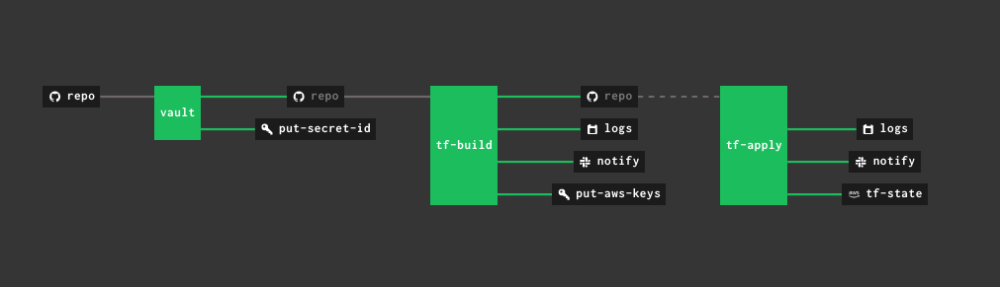

# Secure CI Pipeline by Vault


**Some resources are fake for the demo :)**

## Setup
```shell script
vault write auth/approle/role/aws-read \
policies="aws" \
secret_id_num_uses=1 \
secret_id_ttl="10" \
token_num_uses=1 \
token_ttl="10" \
token_max_ttl="30"
```

```shell script
vault policy write kv-concourse kv-concourse.hcl
vault policy write pull-secret-id pull-secret-id.hcl
vault policy write aws aws.hcl
vault token create -policy kv-concourse
vault token create -policy pull-secret-id
cat << EOF > vars.yml
vault_addr: http://192.168.100.101:8200
vault_kv_token: <<TOKEN-1>>
vault_init_token: <<TOKEN-2>>
EOF
```

## To-Do
* ~~use_limit & TTL for each secret~~
* ACL & Sentinel for KV

